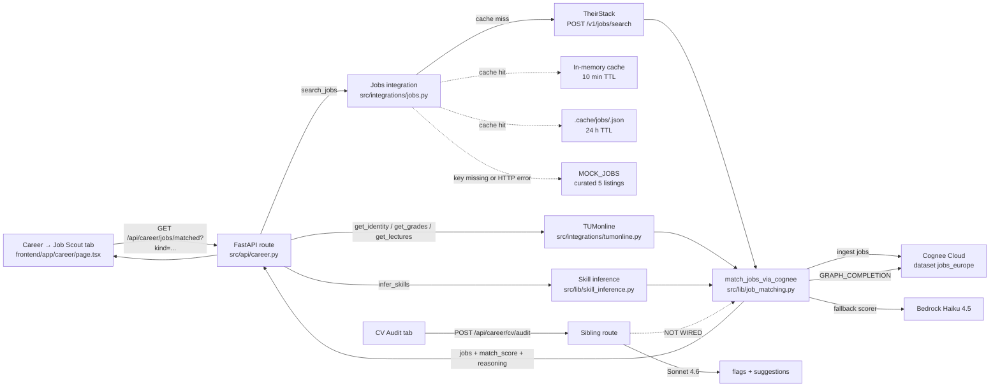

# Career → Jobs Pipeline (TheirStack-backed)

> Self-contained reference for the job search + matching pipeline as of April 2026.
> Hand this file to a fresh chat to onboard quickly. Read alongside
> [`CLAUDE.md`](../CLAUDE.md) and [`ARCHITECTURE.md`](../ARCHITECTURE.md) for repo-wide
> conventions.

---

## TL;DR

The Career page's **Job Scout** tab calls `GET /api/career/jobs/matched?kind=...`.
The backend fetches structured listings from **TheirStack** (Europe-wide, Google
Jobs / SerpAPI was removed), enriches them with the student's **TUMonline academic
record** (grades + current lectures + inferred skills + identity), queries the
**Cognee knowledge graph** for semantic profile-job connections, then scores them
via **Bedrock Haiku** enriched with the KG insights. Results are cached in two
layers (in-memory 10 min + on-disk 24 h) to stay inside TheirStack's 200-credit
free monthly budget. The uploaded CV is **not** part of the matching input today —
CV audit is a separate sibling feature.

---

## Architecture



---

## Request lifecycle for `/api/career/jobs/matched`

1. **Frontend** (`frontend/app/career/page.tsx`) calls `listMatchedJobs(kind)` from
   `frontend/lib/api.ts:479` whenever the Job Scout tab opens or the kind filter
   switches.
2. **Route** `src/api/career.py:list_matched_jobs` runs sequentially:
   - `await search_jobs(kind=kind)` → goes through the cache layers → TheirStack
     (or mock fallback).
   - `await get_identity() / get_grades() / get_lectures()` from TUMonline. On
     failure, profile is filled with neutral defaults so matching still runs.
   - `await infer_skills(grades, lectures)` derives a ranked skills list.
3. **Match** `src/lib/job_matching.py:match_jobs_via_cognee`:
   - Builds a natural-language profile string ("M.Sc. Informatik student … completed
     courses … currently enrolled … skills …").
   - `ingest_jobs` POSTs each job's text to Cognee dataset `jobs_europe`,
     followed by `cognify`.
   - `_query_cognee_insights` issues a `GRAPH_COMPLETION` query for semantic
     profile-job connections (skill overlaps, technology matches, domain fit).
   - `_match_via_haiku` scores each job via a Bedrock Haiku call, enriched with
     Cognee KG insights as additional context in the prompt.
   - On Cognee failure / empty result, the KG insights section is omitted
     and Haiku scores without it (graceful degradation).
4. **Response** is the same dict shape `search_jobs` produces, with two extra
   fields: `match_score: float (0-100)` and `reasoning: str`.

---

## TheirStack integration

Module: [`src/integrations/jobs.py`](../src/integrations/jobs.py)
Endpoint: `POST https://api.theirstack.com/v1/jobs/search`
Docs: <https://api.theirstack.com/en/docs/api-reference/jobs/search_jobs_v1>

### Filter mapping

The API requires at least one of `posted_at_max_age_days`, `posted_at_gte/lte`,
or a company filter. We always send `posted_at_max_age_days=30` and
`job_country_code_or=EUROPE_COUNTRY_CODES` (18 European countries).

| Our `kind`         | TheirStack filters added                                                                          |
|--------------------|--------------------------------------------------------------------------------------------------|
| `working_student`  | `employment_statuses_or=["part_time"]` + `job_title_pattern_or=["(?i)werkstudent","(?i)working student"]` |
| `internship`       | `employment_statuses_or=["internship"]`                                                          |
| `new_grad`         | `employment_statuses_or=["full_time"]` + `job_seniority_or=["junior"]`                           |

Plus:
- `keywords` → `job_description_contains_or` (server-side word-boundary, case-insensitive).
- `company` → `company_name_case_insensitive_or=[company]`.
- `limit` = `settings.theirstack_results_per_call` (default **10**).
- `include_total_results: false` (saves a credit on the count computation).

### Response mapping (`_map_theirstack_result`)

TheirStack returns rich structured fields (`employment_statuses`, `seniority`,
`salary_string`, `min_annual_salary`, `technology_slugs`, `final_url`,
`long_location`, `date_posted` …). We project to the project-internal shape used
by `[src/api/career.py](../src/api/career.py)`, `[src/lib/job_matching.py](../src/lib/job_matching.py)`,
and `[src/agents/career/tools.py](../src/agents/career/tools.py)`:

```python
{
    "id": str,
    "company": str,
    "title": str,
    "kind": "working_student" | "internship" | "new_grad",
    "location": str,
    "salary": str,
    "description": str,        # truncated to 4000 chars
    "source_url": str,         # final_url preferred, falls back to url
    "posted_at": str,          # ISO date
}
```

`_resolve_kind` derives `kind` from `employment_statuses` + `seniority` + a
Werkstudent regex on `job_title`, falling back to the requested kind if
ambiguous.

---

## Caching

Two layers, both keyed on `(kind, sorted(keywords), company, location)`:

| Layer       | Where                                              | TTL                               | Survives restart? |
|-------------|----------------------------------------------------|-----------------------------------|-------------------|
| In-memory   | `_search_cache: dict` in `jobs.py`                | `IN_MEMORY_CACHE_TTL_SECONDS=600` | No                |
| On-disk     | `<cache_dir>/<sha1(key)[:16]>.json`               | `theirstack_cache_ttl_seconds`    | Yes               |

Read order on a `live`-mode call: in-memory → disk → live HTTP. On a successful
HTTP response we write to **both**. All disk I/O is wrapped in
`try/except (OSError, ValueError, TypeError)` so a broken filesystem silently
degrades to "cache miss" instead of breaking jobs.

Logs to grep:
- `theirstack_cache_hit kind=... layer=memory|disk count=N`
- `theirstack_request` / `theirstack_response result_count=N`
- `theirstack_failed_fallback_to_mock` / `theirstack_empty_results_fallback_to_mock`

---

## Configuration

[`src/config.py`](../src/config.py) — Pydantic Settings:

```python
theirstack_api_key: str = ""
jobs_mode: Literal["mock", "live"] = "mock"
theirstack_results_per_call: int = 10
theirstack_cache_dir: str = ".cache/jobs"
theirstack_cache_ttl_seconds: int = 86400   # 24 h
```

`.env.example` documents all five with credit-cost commentary.
`.cache/` is gitignored.

`jobs_mode=mock` (the default) bypasses TheirStack entirely and serves the
five-item `MOCK_JOBS` list (all Munich-based). `jobs_mode=live` requires `theirstack_api_key`;
missing key logs `theirstack_key_missing` and silently serves mock data.

---

## Files at a glance

| Path                                                                                         | Role                                                                                  |
|----------------------------------------------------------------------------------------------|---------------------------------------------------------------------------------------|
| [`src/integrations/jobs.py`](../src/integrations/jobs.py)                                    | TheirStack client, mock fallback, two-layer cache, `search_jobs` public surface       |
| [`src/api/career.py`](../src/api/career.py)                                                  | `/api/career/jobs`, `/api/career/jobs/matched`, `/api/career/cv/audit`, `/events`     |
| [`src/lib/job_matching.py`](../src/lib/job_matching.py)                                      | Cognee ingestion + KG query + Haiku scorer enriched with KG insights                 |
| [`src/lib/skill_inference.py`](../src/lib/skill_inference.py)                                | Derives ranked skills from TUMonline grades + lectures                                |
| [`src/integrations/tumonline.py`](../src/integrations/tumonline.py)                          | `get_identity / get_grades / get_lectures` — source of truth for the academic profile |
| [`src/agents/career/tools.py`](../src/agents/career/tools.py)                                | `@tool search_jobs(...)` exposed to the Career LangGraph agent                        |
| [`src/models/job.py`](../src/models/job.py)                                                  | Pydantic `Job` model (frozen value object)                                            |
| [`scripts/warmup_jobs.py`](../scripts/warmup_jobs.py)                                        | Batched cache primer for the Informatics persona (Europe-wide)                        |
| [`tests/unit/test_jobs.py`](../tests/unit/test_jobs.py)                                      | Unit tests covering payload, mapping, mock, routing, caching                          |
| [`tests/unit/test_job_matching.py`](../tests/unit/test_job_matching.py)                      | Unit tests for Cognee KG insights + Haiku scoring pipeline                            |
| [`frontend/app/career/page.tsx`](../frontend/app/career/page.tsx)                            | Job Scout tab UI                                                                      |
| [`frontend/lib/api.ts`](../frontend/lib/api.ts)                                              | `listMatchedJobs(kind)`, `getStudentProfile()`, `uploadCvForAudit(file)`              |

---

## Testing

### Unit tests (no network, no credits)

```bash
uv run pytest tests/unit/test_jobs.py -v   # 30 tests
```

The autouse fixture clears the in-memory cache between tests and points the
disk cache at a non-existent path so test runs never read your real
`.cache/jobs/`.

### Live integration smoke (≤5 credits per call, no caching path)

`_search_theirstack` does no caching:

```bash
JOBS_MODE=live uv run python -c "
import asyncio, json
from src.integrations.jobs import _search_theirstack
rows = asyncio.run(_search_theirstack(
    kind='working_student',
    keywords=['machine learning', 'artificial intelligence'],
    location='Munich',
))
print(f'count={len(rows)}'); print(json.dumps(rows[:2], indent=2, ensure_ascii=False))
"
```

### Warm the cache for a free 24 h of UI traffic (~90 credits)

```bash
JOBS_MODE=live uv run python scripts/warmup_jobs.py
```

Multiple batched TheirStack calls per kind for the Informatics persona
(Europe-wide). Subsequent UI/agent traffic hits `layer=disk` cache hits.

### Force a cache-free UI session

Either:
- Set `THEIRSTACK_CACHE_TTL_SECONDS=0` in `.env` and restart `uvicorn` between
  clicks (kills disk + resets in-memory).
- Or `rm -rf .cache/jobs` between cold restarts.

### Verify TheirStack is the source (not silent mock fallback)

- `posted_at` is a current ISO date (`2026-04-1x`-ish).
- `source_url` resolves to a third-party listing (LinkedIn, careers page, …),
  not `https://jobs.bmw.com/ws-ad-sim` (mock).
- Backend log shows `theirstack_response result_count=N`, no
  `theirstack_failed_fallback_to_mock`.
- TheirStack credit balance:

  ```bash
  curl -s -H "Authorization: Bearer $THEIRSTACK_API_KEY" \
    https://api.theirstack.com/v0/teams/credits | jq
  ```

---

## Credit budget

Free plan: **200 API + 50 company credits / month**, **1 credit per job
returned**, **max 25 results / page**, **2 req/s**.

With current defaults (`THEIRSTACK_RESULTS_PER_CALL=10`, 3 keyword batches):

| Action                                                | Credits       |
|-------------------------------------------------------|---------------|
| One full warm-up run (3 kinds × 3 batches × 10)       | up to **90**  |
| Repeat warm-up within 24 h                            | **0** (disk cache) |
| Job Scout tab open after warm-up                      | **0**         |
| Switching `kind` after warm-up                        | **0**         |
| `_search_theirstack` direct one-shot                  | up to 10      |
| One run of `tests/unit/test_jobs.py`                  | **0** (mocked) |

→ ~2 cold warm-up runs/month available on the free tier.

---

## Known gaps & extension hooks

- **CV is not part of matching input.** `/api/career/cv/audit` extracts CV PDF
  text and produces `flags` + `suggestions` against the academic record, but
  that text never reaches `match_jobs_via_cognee`. Wiring it in means: persist
  parsed CV text per student (e.g. into Cognee under `dataset_name=f"student_{user_id}"`),
  pass it as an additional input to `_build_profile_query`, and re-cognify.
- **Pagination is hard-capped at one page.** `_build_theirstack_payload` always
  sends `page=0`. The free plan allows up to 5 pages × 25 results. Bumping is
  trivial but credits scale linearly.
- **No `nocache` toggle.** Disabling the in-memory cache requires a uvicorn
  restart today. A `theirstack_disable_cache: bool` setting would be ~3 lines.
- **Cognee match_cache is per-process.** `_match_cache` in `job_matching.py` is
  cleared on restart, so the first call after restart re-ingests jobs into
  Cognee even if disk-cached TheirStack data is hot.
- **`technology_slugs` from TheirStack is currently dropped.** Could replace
  the LLM keyword-matching scorer with a deterministic skill-overlap score
  (intersect inferred TUM skills × TheirStack technology slugs) for cheaper,
  faster, more explainable matching.

---

## History

- **Pre-April 2026:** SerpAPI Google Jobs. Returned unstructured scrapes —
  `description`, `salary`, `posted_at`, and Werkstudent classification were all
  inconsistent.
- **April 2026:** Swapped to TheirStack with structured filters
  (`employment_statuses`, `seniority`, `salary_string`, `technology_slugs`).
  Public `search_jobs(...)` signature preserved, downstream Cognee/Haiku matcher
  untouched. Added two-layer cache + warm-up script to fit free tier budget.
